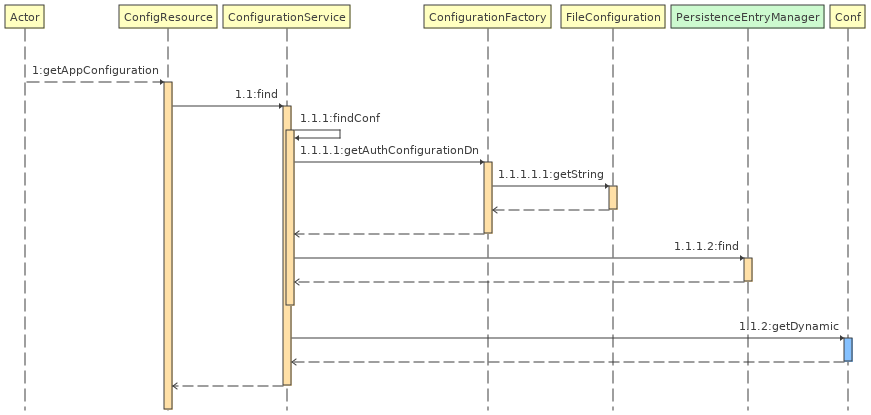

# Janssen code notes

### code involved in loading configuration

- `io.jans.as.common.service.common.ConfigurationService`:
  - allows to add and update configuration in the database using `PersistenceEntryManager`. Also provides other methods.
- jans-orm : `FileConfiguration` is used to read configuration from property files

### Misc notes:

- jans-auth-server `AppInitializer` class loads all the services required by jans-server, like persistence manager.
  - `AppInitializer` uses methods in `ApplicationFactory` to read properties stored in files and create objects like `PersistenceEntryManagerFactory` using `PersistanceFactoryService` which is injected in `ApplicationFactory`
- To see which entity classes are mapped to which tables, search for `@ObjectClass` in jans-auth-server project. You'll find `@ObjectClass(tablename)`.
  - there are many `model` packages in AS but only few (~23) are persistence related. Others (like `CodeVerifier` under `io.jans.as.model.authorize` package) are not related to persistance rather they are like POJOs.
- `objectClass` is the name of the table. This is visible from `SqlConnectionProvider`.`getTableMappingByKey()`.
- 

### properties and featureflags

- Classes that hold the properties of some of the modules are below:
  - io.jans.as.model.configuration.AppConfiguration
  - io.jans.as.model.common.FeatureFlagType
  - io.jans.fido2.model.conf.Fido2Configuration
  - io.jans.scim.model.conf.AppConfiguration

## jans-config-api

### code flow for `/jans-config-api/api/v1/jans-auth-server/config` endpoint

- One thing to notice here is that config-api doesn't depend on jans-auth-server to fetch the configuration. Rather it directly reaches to persistence to get the properties
- but it uses the model from jans-auth-server (i.e `conf`) to hold these properties fetched from the db.




## Code involved in client authentication

- `AuthenticationFilter` is the main class. It is a `@WebFilter` and filters every request coming at below mentioned endpoints
   ```
                "/restv1/authorize",
                "/restv1/token",
                "/restv1/userinfo",
                "/restv1/revoke",
                "/restv1/revoke_session",
                "/restv1/bc-authorize",
                "/restv1/par",
                "/restv1/device_authorization",
                "/restv1/register",
                "/restv1/ssa"
   ```
   
   This class is a servlet filter as it implements `jakarta.servlet.Filter` interface and overrides `doFilter` method
   
 - it seems that some endpoints authenticate clients, but there are certain endpoints that authenticate user. See if condition at [line](https://github.com/JanssenProject/jans/blob/9c68f914e155de492e54121033c8f0ed45d66817/jans-auth-server/server/src/main/java/io/jans/as/server/auth/AuthenticationFilter.java#L383). For these endpoints it'll invoke client auth, and for rest of the endpoints it'll invoke user auth.
 - actual method that compares clientId and secret with what is stored in backend is the `authenticate` method in `ClientService` class. [here](https://github.com/JanssenProject/jans/blob/f793f92fa275da2e57b2302dcb5c6fdb27666e67/jans-auth-server/server/src/main/java/io/jans/as/server/service/ClientService.java#L106)

### code for redirect URI

- `io.jans.as.server.service.RedirectionUriService.validateRedirectionUri()` : is where incoming URI from various requests get compared with what is registered by client
- 
